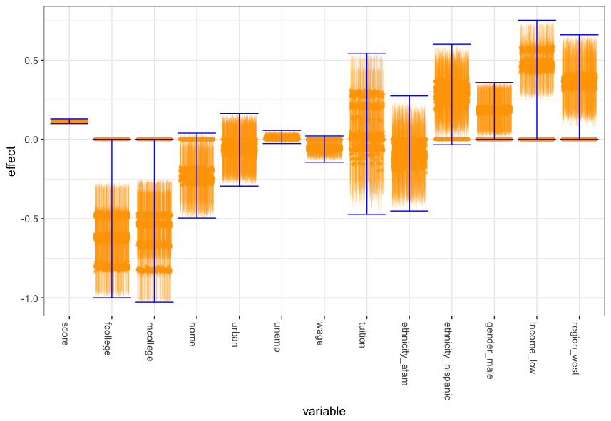

## Causal Inference with Invariant Prediction

[](https://travis-ci.org/richardkwo/InvariantCausal) [](https://coveralls.io/github/richardkwo/InvariantCausal?branch=master)



This is a Julia v.0.6 implementation for the Invariant Causal Prediction algorithm of [Peters, Bühlmann and Meinshausen](https://doi.org/10.1111/rssb.12167). The method uncovers direct causes of a target variable from datasets under different environments (e.g., interventions or experimental settings). 

See also this [R package](https://cran.r-project.org/package=InvariantCausalPrediction) and [this report](docs/InvariantCausal.pdf).

#### Changelog

- 2018/06/20: version 0.1.1

#### Dependencies

[DataStructures.jl](https://github.com/JuliaCollections/DataStructures.jl), [StatsBase.jl](https://github.com/JuliaStats/StatsBase.jl), [GLM.jl](https://github.com/JuliaStats/GLM.jl), [DataFrames.jl](https://github.com/JuliaData/DataFrames.jl), [GLMNet.jl](https://github.com/JuliaStats/GLMNet.jl) (for lasso screening and requires `gfortran`) and [UnicodePlots.jl](https://github.com/Evizero/UnicodePlots.jl).

### Installation

Install the package via typing the following in Julia REPL.

```julia
julia> Pkg.add("InvariantCausal")
```

Alternatively, you can install the latest from GitHub.

```Julia
julia> Pkg.clone("https://github.com/richardkwo/InvariantCausal.git")
```

Use the following to run a full test.

```julia
julia> using InvariantCausal
julia> InvariantCausal._test_full()
```

### Quick Start

Generate a simple [Gaussian structure equation model](https://en.wikipedia.org/wiki/Structural_equation_modeling?oldformat=true) (SEM) with random graph with 21 variables and average degree 3. Note that we assume the SEM is acyclic. The model can be represented as `X = B X + ϵ` with zeros on the diagonals of B (no self-loop). `ϵ` is a vector of independent Gaussian errors. For a variable `i`, variables `j` with coefficients `B[i,j]` non-zero are called the direct causes of `i`. We assume `B` is sparse, and its sparsity pattern is visualized with [UnicodePlots.jl](https://github.com/Evizero/UnicodePlots.jl).

```julia
julia> using InvariantCausal

julia> srand(1926)
julia> sem_obs = random_gaussian_SEM(21, 3)
Gaussian SEM with 21 variables:
B =
      Sparsity Pattern
      ┌─────────────┐
    1 │⠀⠀⠂⠄⠀⠔⠀⠀⠂⠂⡆│ > 0
      │⢀⢠⠈⡀⠠⠠⣀⠀⠀⠅⠀│ < 0
      │⠀⠐⠉⠀⠈⠠⠘⠀⠀⠆⠉│
      │⠀⠐⢠⠀⠀⡀⠐⠀⢂⠀⡂│
      │⠀⠠⢐⠀⠉⠵⠠⠁⠄⠈⠂│
   21 │⠈⠄⠸⠀⠀⠈⠀⠀⠉⠀⠁│
      └─────────────┘
      1          21
        nz = 63
σ² = [1.3996, 1.37975, 1.87259, 1.15587, 0.631316, 1.38616, 1.45151, 1.73923, 1.55834, 1.11023, 1.24599, 0.958217, 0.834141, 1.94525, 1.4888, 1.53593, 1.69174, 0.649617, 1.121, 1.14597, 0.692029]
```

Suppose we want to infer the direct causes for the last variables, which are

```julia
julia> causes(sem_obs, 21)
2-element Array{Int64,1}:
 2
 5
```

Firstly, let us generate some observational data and call it environment 1.

```julia
julia> X1 = simulate(sem_obs, 1000)
```

Then, we simulate from environment 2 by performing do-intervention on variables 3, 4, 5, 6. Here we set them to fixed random values.

```julia
julia> X2 = simulate(sem_obs, [3,4,5,6], randn(4), 1000)
```

We run the algorithm on environments 1 and 2.

```julia
julia> causalSearch(vcat(X1, X2)[:,1:20], vcat(X1, X2)[:,21], repeat([1,2], inner=1000))

8 variables are screened out from 20 variables with lasso: [2, 5, 6, 8, 13, 15, 16, 20]
Causal invariance search across 2 environments with at α=0.01 (|S| = 8, method = chow)

S = []                                      : p-value = 0.0000 [ ] ⋂ = [2, 5, 6, 8, 13, 15, 16, 20]
S = [2]                                     : p-value = 0.1376 [*] ⋂ = [2]
S = [20]                                    : p-value = 0.0000 [ ] ⋂ = [2]
S = [16]                                    : p-value = 0.0000 [ ] ⋂ = [2]
S = [15]                                    : p-value = 0.0000 [ ] ⋂ = [2]
                                     ...
S = [2, 5, 6]                               : p-value = 0.3557 [*] ⋂ = [2]
S = [5, 6, 20]                              : p-value = 0.1879 [*] ⋂ = Int64[]

 * Found no causal variable (empty intersection).

 ⋅ Variables considered include [2, 5, 6, 8, 13, 15, 16, 20]
```

The algorithm cannot find any direct causal variables (parents) of variable 21 due to insufficient power of two environments. The algorithm tends to discover more with more environments. Let us define a new environment where we perform a noise (soft) intervention that changes the equations for 5 variables other than the target. Note it is important that the target is left untouched.

```Julia
julia> sem_noise, variables_intervened = random_noise_intervened_SEM(sem_obs, p_intervened=5, avoid=[21])

(Gaussian SEM with 21 variables:
B =
      Sparsity Pattern
      ┌─────────────┐
    1 │⠀⠀⠂⠄⠀⠔⠀⠀⠂⠂⡆│ > 0
      │⢀⢠⠈⡀⠠⠠⣀⠀⠀⠅⠀│ < 0
      │⠀⠐⠉⠀⠈⠠⠘⠀⠀⠆⠉│
      │⠀⠐⢠⠀⠀⡀⠐⠀⢂⠀⡂│
      │⠀⠠⢐⠀⠉⠵⠠⠁⠄⠈⠂│
   21 │⠈⠄⠸⠀⠀⠈⠀⠀⠉⠀⠁│
      └─────────────┘
      1          21
        nz = 63
σ² = [1.3996, 1.20882, 1.87259, 1.15587, 0.631316, 1.38616, 1.45151, 1.73923, 2.55396, 1.11023, 1.24599, 0.958217, 0.506628, 1.94525, 2.16212, 1.53593, 1.69174, 0.649617, 1.121, 2.19366, 0.692029], [9, 15, 13, 2, 20])
```

Here the equations for variables 9, 15, 13, 2, 20 have been changed. Now we simulate from this modified SEM and call it environment 3. We run the algorithm on all 3 environments.

```Julia
julia> X3 = simulate(sem_noise, 1000)
julia> causalSearch(vcat(X1, X2, X3)[:,1:20], vcat(X1, X2, X3)[:,21], repeat([1,2,3], inner=1000))
```

The algorithm searches over subsets for a while and successfully discovers variables 2. 

```
8 variables are screened out from 20 variables with lasso: [1, 2, 5, 6, 8, 13, 15, 20]
Causal invariance search across 3 environments with at α=0.01 (|S| = 8, method = chow)

S = []                                      : p-value = 0.0000 [ ] ⋂ = [1, 2, 5, 6, 8, 13, 15, 20]
S = [1]                                     : p-value = 0.0000 [ ] ⋂ = [1, 2, 5, 6, 8, 13, 15, 20]
S = [20]                                    : p-value = 0.0000 [ ] ⋂ = [1, 2, 5, 6, 8, 13, 15, 20]
S = [15]                                    : p-value = 0.0000 [ ] ⋂ = [1, 2, 5, 6, 8, 13, 15, 20]
S = [13]                                    : p-value = 0.0000 [ ] ⋂ = [1, 2, 5, 6, 8, 13, 15, 20]
S = [8]                                     : p-value = 0.0000 [ ] ⋂ = [1, 2, 5, 6, 8, 13, 15, 20]
S = [6]                                     : p-value = 0.0000 [ ] ⋂ = [1, 2, 5, 6, 8, 13, 15, 20]
S = [5]                                     : p-value = 0.0001 [ ] ⋂ = [1, 2, 5, 6, 8, 13, 15, 20]
S = [2]                                     : p-value = 0.1714 [*] ⋂ = [2]
S = [5, 1]                                  : p-value = 0.0000 [ ] ⋂ = [2]
S = [2, 5]                                  : p-value = 0.2211 [*] ⋂ = [2]
S = [5, 20]                                 : p-value = 0.0000 [ ] ⋂ = [2]
                                      ...
S = [1, 13, 2, 5, 8, 15, 6]                 : p-value = 0.4380 [*] ⋂ = [2]
S = [20, 6, 13, 2, 5, 8, 15, 1]             : p-value = 0.6916 [*] ⋂ = [2]

 * Causal variables include: [2]

variable   	 1.0 % 		 99.0 %
2          	 0.5831 	 0.7054

 ⋅ Variables considered include [1, 2, 5, 6, 8, 13, 15, 20]
```

### Functionalities

- The main algorithm `causalSearch(X, y, env, [S]; α=0.01, method="chow", screen="auto", p_max=8, verbose=true, selection_only=false, n_max_for_exact=5000)` 
  - Performs screening if number of covariates exceeds `p_max`
    - `screen="auto"`: `"HOLP"` when p > n, `"lasso"` otherwise
    - `screen="HOLP"`: [High dimensional ordinary least squares projection for screening variables](https://doi.org/10.1111/rssb.12127) when p ≧ n
    - `screen="lasso"`: lasso solution path from `glmnet`
  - Skips supersets of an accepted set under `selection_only = true`, but confidence intervals are not reported
  - When sample size exceeds `n_max_for_exact`, sub-sampling is used for Chow test
- Methods
  - `method="chow"`: Chow test for linear regression
  - `method="logistic-LR"`: likelihood-ratio test for logistic regression
  - `method="logistic-SF"`: [Sukhatme-Fisher test](http://www.jstor.org/stable/2286870) for testing equal mean and variance of logistic prediction residuals
- SEM utilities: `random_gaussian_SEM`, `random_noise_intervened_SEM`, `simulate`, `causes` and `cov` for generating random SEM (Erdos-Renyi), simulation and interventions.
- Variables screening:
  - Lasso (with `glmnet`): `screen_lasso(X, y, pmax)`

###  Features

- High performance implementation in Julia v.0.6
- Faster search: 
  - skipping testing supersets of A if A is accepted ( under  `selection_only` mode)
  - Priority queue to prioritize testing sets likely to be invariant

### Todo

- ~~Confidence intervals~~
- ~~Logistic regression~~
- ~~Variable screening~~
  - ~~glmnet~~
  - ~~HOLP~~
- ~~Subsampling for large n in Chow's test~~
- Nonparametric two-sample tests
- Hidden variable case
- ~~Inference of graph and plotting~~

### Issues

- ~~Better reporting~~

